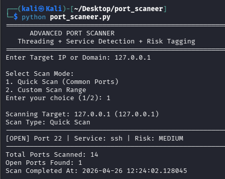
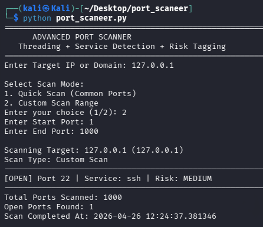
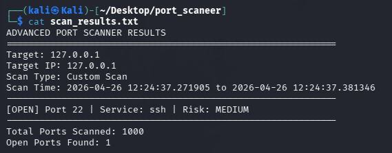

# 🔍 Advanced Port Scanner Using Python

## 📖 Description

This project is an advanced Python-based port scanner that identifies open ports on a target system. It uses multithreading for faster scanning and includes risk classification and multiple scan modes for better analysis.

## ⚙️ Features

* Fast scanning using multithreading

* Detects open ports

* Identifies common services

* Risk classification (Low, Medium, High)

* Multiple scan modes (Quick Scan \& Custom Scan)

* Saves results to a file

## 🛠️ Technologies Used

* Python

* Socket Programming

* ThreadPoolExecutor

* Kali Linux

## ▶️ How to Run

Run the following command in the terminal:

python3 port_scanner.py

## 📸 Screenshots

### Quick Scan Output

### Custom Scan Output

### Saved Results File

## 🔐 Risk Classification

* HIGH → 21, 23, 445, 3389

* MEDIUM → 22, 25, 110, 139, 143, 3306

* LOW → 53, 80, 443

* UNKNOWN → Other ports

## 📂 Project Structure

PortScanner/

│── port_scanner.py

│── scan_results.txt

│── README.md

│── Advanced_Port_Scanner_Report.pdf

│── screenshots/

│   ├── quick_scan.png

│   ├── custom_scan.png

│   ├── results.png

## ⚠️ Disclaimer

This tool is developed for educational purposes only. Use it only on authorized systems. Unauthorized port scanning may be illegal.

## 👤 Author

Samyak Bhaisare

